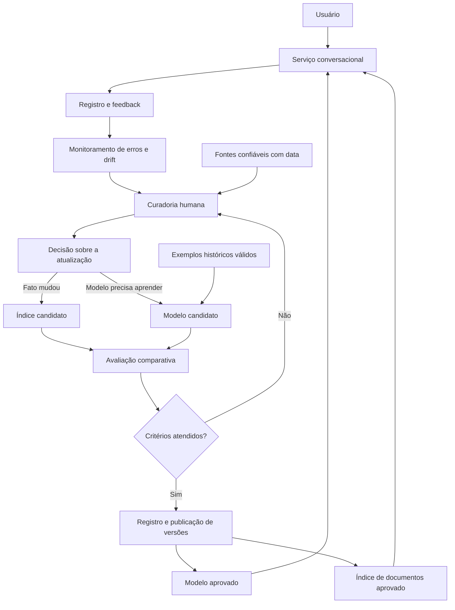

# Aprendizado contínuo em um sistema conversacional: proposta e comparação de estratégias

**Autora:** Mariana Reis

**Atividade:** Proposta de atualização de um sistema conversacional (alternativa 1)

## 1. Introdução

Um sistema conversacional pode responder bem durante seus testes iniciais e perder qualidade depois de entrar em uso. Pessoas passam a fazer perguntas sobre assuntos novos, documentos são substituídos e informações antes corretas deixam de valer. Um modelo treinado em um conjunto fixo de dados não incorpora automaticamente essas mudanças. Por exemplo, a pergunta “qual é o prazo de inscrição?” pode permanecer igual enquanto a resposta correta muda a cada período.

O problema se relaciona ao *concept drift*, isto é, à mudança das relações estatísticas que sustentam as previsões ao longo do tempo (GAMA et al., 2014). Se `x` representa uma pergunta e `y` a resposta esperada, uma regra nova pode alterar `P(y|x)`: para uma pergunta semelhante, a resposta correta passa a ser outra. Mudanças apenas na frequência ou na forma das perguntas também merecem monitoramento, mas não provam, sozinhas, que a resposta correta mudou. Por isso, uma queda observada no desempenho deve iniciar uma investigação, não um retreinamento automático.

O aprendizado contínuo busca incorporar informações novas preservando o que ainda é válido. Seu desafio é o *esquecimento catastrófico*: ao aprender dados recentes, um modelo pode piorar em conhecimentos anteriores (PARISI et al., 2019). Jang et al. (2022), no artigo fornecido como apoio, propõem verificar separadamente três capacidades durante a atualização de modelos de linguagem: **reter conhecimento invariável, corrigir conhecimento desatualizado e adquirir conhecimento novo**. Essas três perguntas orientam tanto a arquitetura quanto a comparação apresentada neste trabalho.

**Recorte da proposta.** Considero um assistente genérico que responde perguntas com um modelo de linguagem e pode consultar documentos aprovados. Seu conhecimento pode ser atualizado de duas maneiras diferentes: alterando a base externa consultada na resposta ou atualizando parâmetros do modelo. A primeira é útil para mudanças factuais rápidas; a segunda constitui o caminho de aprendizado contínuo do modelo. A proposta combina ambas, mas só chama de atualização do modelo aquilo que efetivamente muda seus parâmetros.

## 2. Solução proposta

### 2.1. Arquitetura e fluxo de atualização

O serviço atende com versões aprovadas. Registros de uso e fontes novas alimentam a investigação. A curadoria decide se há apenas um documento desatualizado ou se o comportamento do modelo também precisa mudar. Cada alternativa produz uma versão candidata, testada antes de chegar aos usuários. O retorno no diagrama representa um novo ciclo de publicação, não uma troca instantânea durante a conversa.

| Bloco | Responsabilidade e saída |
| --- | --- |
| Serviço conversacional | Receber a pergunta, consultar o índice quando necessário e gerar uma resposta com o modelo publicado. Registrar as versões utilizadas. |
| Modelo aprovado | Produzir as respostas em produção; manter uma versão anterior disponível para reversão. |
| Índice de documentos aprovado | Recuperar trechos de fontes verificadas, com identificação de origem e data de validade. |
| Registro e feedback | Guardar amostras de perguntas, respostas, reformulações e correções. Minimizar dados pessoais antes de usá-los em análise ou treinamento. |
| Monitoramento de erros e drift | Comparar períodos, acompanhar respostas corrigidas e identificar temas novos. Emitir alertas para investigação, sem tomar sozinho a decisão de treinar. |
| Fontes confiáveis com data | Estabelecer qual informação estava correta em cada período, permitindo distinguir um erro do modelo de uma mudança real. |
| Curadoria humana | Verificar fontes, remover exemplos incorretos e separar os casos em conhecimento estável, alterado e novo. |
| Decisão sobre a atualização | Escolher uma mudança no índice, no modelo ou em ambos e registrar o motivo da escolha. |
| Índice candidato | Disponibilizar documentos atualizados para teste antes de trocar o índice em produção. |
| Modelo candidato | Ajustar o modelo com dados revisados, mantendo controle sobre o conjunto usado e a versão produzida. |
| Exemplos históricos válidos | Apoiar os testes de regressão e, quando apropriado, o treinamento com exemplos anteriores. |
| Avaliação comparativa | Executar as mesmas perguntas na solução atual e em cada candidata, medindo qualidade, regressões, custo e tempo de resposta. |
| Registro e publicação de versões | Publicar apenas a candidata aprovada, registrar dados e métricas e permitir voltar à versão anterior. |

### 2.2. Comparação das formas de atualização

A escolha da adaptação depende do que mudou. A tabela explicita os benefícios e os limites de três estratégias que poderiam ser testadas sob as mesmas perguntas.

| Estratégia | O que muda | Vantagem esperada | Limitação principal | Situação em que eu a testaria |
| --- | --- | --- | --- | --- |
| Atualizar documentos recuperados (*RAG*) | Fonte externa e índice; os parâmetros do modelo ficam iguais | Informação pode ser corrigida de modo rastreável e reversível | Uma busca pode recuperar o trecho errado, e o modelo ainda pode ignorar a fonte ou responder com conhecimento antigo | Prazo, regra ou documento que mudou e possui fonte autorizada |
| Continuar o treinamento sem mecanismo de preservação | Parâmetros do modelo | Pode incorporar informação ao comportamento do modelo | Pode esquecer fatos válidos e exige dados, processamento e nova validação | Linha de base experimental para medir o custo do esquecimento |
| Atualização com parâmetros adicionais, como adaptadores | Parte treinável acrescentada ao modelo | Permite testar a aquisição de conhecimento mantendo parte do modelo anterior | Aumenta a complexidade de versões e não garante, por si só, que fatos recentes serão aprendidos corretamente | Falhas recorrentes que a atualização de documentos não resolve |

O RAG combina geração com recuperação de documentos externos (LEWIS et al., 2020). Por isso, atualizar seu índice é uma intervenção no **sistema conversacional**, mas não equivale a aprendizado contínuo dos parâmetros do modelo. Já o ajuste com adaptadores é um caminho para estudar esse aprendizado. A recomendação é começar pela mudança reversível na fonte quando o problema for factual e só treinar uma candidata quando a avaliação mostrar uma necessidade persistente. Essa regra é uma **decisão de projeto**, não um resultado medido neste trabalho.

### 2.3. Comparação empírica do artigo de apoio

Para fundamentar a escolha técnica, comparei resultados da **Tabela 2 de Jang et al. (2022)**. Os números abaixo são dos autores, em um experimento com T5 e bases de conhecimento geral; **não são resultados do sistema proposto nem uma simulação minha**. `IL` mede conhecimento invariável, `UL` conhecimento que precisava ser atualizado e `NL` conhecimento novo. Os três valores são porcentagens de respostas exatas (*exact match*), em que **maior é melhor**. `FUAR` relaciona esquecimento a atualização e aquisição; **menor é melhor**.

| Método estudado por Jang et al. | IL ↑ | UL ↑ | NL ↑ | FUAR ↓ |
| --- | ---: | ---: | ---: | ---: |
| T5 inicial, sem atualização | 24,17 | 1,62 | 1,88 | — |
| Continuação simples (*Vanilla*) | 12,89 | 10,17 | 3,77 | 1,08 |
| Mistura de dados antigos (*Mix-Review*) | 13,92 | 6,49 | 2,89 | 1,74 |
| LoRA | 16,58 | 12,77 | 4,52 | 0,55 |
| K-Adapters, duas camadas | 19,59 | 12,34 | 5,03 | 0,33 |

Nesse experimento, a continuação simples melhorou `UL` e `NL`, mas reduziu `IL` de 24,17 para 12,89. A mistura de dados antigos preservou um pouco mais de `IL` do que a continuação simples, porém aprendeu menos nos grupos `UL` e `NL`. Entre os métodos mostrados, K-Adapters preservou mais conhecimento invariável (`IL = 19,59`) e obteve o menor `FUAR` (`0,33`). Isso sustenta **testar** uma estratégia com parâmetros adicionais em vez de assumir que misturar exemplos antigos sempre resolverá o problema. Os resultados são específicos do modelo, dos dados e da métrica dos autores; não permitem prever o ganho em outro assistente.

Essa comparação também impede uma conclusão apressada: o artigo não avaliou, nessa tabela, um assistente com RAG atualizado. A comparação entre RAG e ajuste do modelo precisaria ser feita no próprio sistema, com as mesmas perguntas e condições de uso.

### 2.4. Plano de avaliação da proposta

Antes de implementar a atualização, eu criaria um conjunto de perguntas revisadas por pessoas responsáveis pelas fontes. Cada caso teria pergunta, resposta esperada, fonte, período de validade e categoria. Três grupos seriam mantidos separados: **estável** (deve continuar correto), **alterado** (a resposta anterior se tornou incorreta) e **novo** (não havia informação anterior suficiente). Exemplos usados para medir desempenho não entrariam no treinamento. A comparação teria ao menos três configurações: sistema atual, índice RAG atualizado sem mudar o modelo e índice atualizado com modelo candidato.

| Medida | Pergunta que responde | Critério para comparar |
| --- | --- | --- |
| Correção no grupo estável | A atualização prejudicou conhecimentos válidos? | Comparar a proporção de respostas corretas com a versão atual. |
| Correção no grupo alterado | O sistema abandonou informações antigas? | Verificar se usa a versão vigente, citando a fonte quando ela é consultada. |
| Correção no grupo novo | O sistema aprendeu ou encontrou assuntos novos? | Medir respostas corretas e casos em que reconhece não saber. |
| Resposta sem respaldo | O sistema afirma algo que a fonte não sustenta? | Registrar frequência e gravidade em revisão humana. |
| Latência e custo | A melhoria mantém o atendimento viável? | Medir tempo de resposta e custo por consulta em condições equivalentes. |

Uma atualização seria aprovada somente após análise conjunta dessas medidas. Como **exemplo de regra para um piloto**, eu exigiria ganho nos grupos alterado e novo, perda máxima previamente acordada no grupo estável e nenhuma elevação de respostas sem respaldo. Os limites numéricos dependeriam da linha de base e do risco do assunto; defini-los sem dados reais criaria uma precisão falsa. Depois dos testes, a publicação seria gradual e acompanhada de monitoramento, com retorno à versão anterior se o desempenho piorasse.

## 3. Conclusão e esforço de implementação

Na minha avaliação, o ponto mais importante da proposta é não confundir “receber dados novos” com “aprender corretamente”. O artigo de Jang et al. (2022) mostra por que ganhar conhecimento recente e preservar o antigo precisam ser avaliados juntos. A comparação entre métodos também mudou minha escolha inicial: usar apenas exemplos históricos no treinamento parece simples, mas não foi suficiente no experimento analisado. Eu começaria atualizando fontes verificadas e medindo o resultado; se o modelo continuasse errando de forma recorrente, avaliaria uma atualização com adaptadores.

O trabalho de implementação está menos no comando de treinamento e mais na preparação de dados confiáveis. É necessário registrar versões de fontes e respostas, obter correções humanas, separar conjuntos de teste, executar comparações justas e acompanhar a publicação. Conversas de usuários não deveriam virar exemplos de treinamento sem revisão, pois podem conter erros ou dados pessoais.

Para tornar o esforço concreto, considero um piloto em um assistente já existente, com uma pessoa de desenvolvimento, uma de dados/ML e revisão parcial por alguém responsável pelo conteúdo. Minha estimativa **pessoal e preliminar**, sujeita à infraestrutura disponível, seria:

| Etapa sequencial | Entrega esperada | Tempo de calendário estimado |
| --- | --- | ---: |
| Preparar dados e métricas | Fontes versionadas, coleta mínima e conjunto de perguntas revisado | 2 a 3 semanas |
| Comparar alternativas | Índice atualizado, candidata com ajuste de parâmetros e avaliação nos três grupos | 3 a 5 semanas |
| Publicar e acompanhar | Liberação gradual, alertas e reversão testada | 1 a 2 semanas |
| **Piloto** | **Decisão baseada em resultados observados** | **6 a 10 semanas** |

Essa estimativa não inclui construir o assistente do zero nem obter autorização para acessar dados indisponíveis. A proposta continua limitada enquanto não houver experimentos com interações reais e fontes do domínio escolhido. Sua contribuição é oferecer uma arquitetura, uma comparação fundamentada e um modo verificável de decidir quando cada atualização vale a pena.

## Referências bibliográficas

GAMA, João et al. A survey on concept drift adaptation. **ACM Computing Surveys**, New York, v. 46, n. 4, art. 44, p. 1-37, 2014. DOI: 10.1145/2523813. Disponível em: https://doi.org/10.1145/2523813. Acesso em: 4 out. 2026.

JANG, Joel et al. Towards continual knowledge learning of language models. In: INTERNATIONAL CONFERENCE ON LEARNING REPRESENTATIONS, 2022. **Proceedings [...].** [S. l.]: ICLR, 2022. Disponível em: https://arxiv.org/abs/2110.03215. Acesso em: 4 out. 2026.

LEWIS, Patrick et al. Retrieval-augmented generation for knowledge-intensive NLP tasks. In: ADVANCES IN NEURAL INFORMATION PROCESSING SYSTEMS, 33., 2020. **Proceedings [...].** [S. l.]: NeurIPS, 2020. Disponível em: https://arxiv.org/abs/2005.11401. Acesso em: 4 out. 2026.

PARISI, German I. et al. Continual lifelong learning with neural networks: a review. **Neural Networks**, Amsterdam, v. 113, p. 54-71, 2019. DOI: 10.1016/j.neunet.2019.01.012. Disponível em: https://doi.org/10.1016/j.neunet.2019.01.012. Acesso em: 4 out. 2026.
