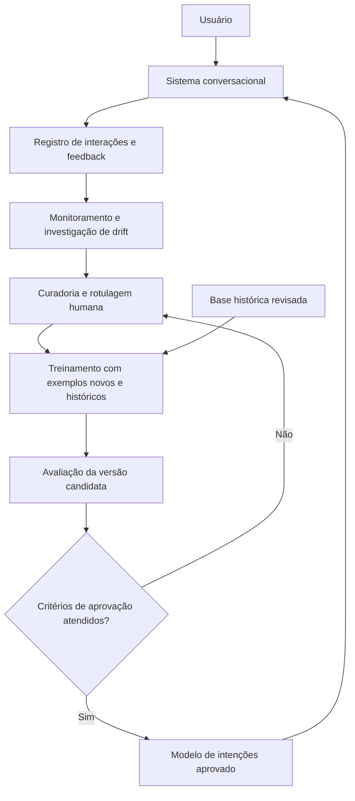

# Proposta de aprendizado contínuo para o sistema conversacional de gestão de portfólio

**Autora:** Mariana Reis

**Tema:** Alternativa 1 — aprendizado contínuo

## 1. Introdução

O sistema conversacional desenvolvido para apoiar a gestão do portfólio de projetos do Metrô de São Paulo recebe perguntas em linguagem natural e identifica a intenção do usuário antes de encaminhar a solicitação. O projeto já possui um classificador de intenções treinado com um conjunto de exemplos e uma rotina de avaliação. Porém, um modelo treinado em um conjunto fixo representa o vocabulário e os padrões de solicitação conhecidos naquele momento. Novos processos, tipos de consulta e formas de expressão podem surgir durante o uso do sistema.

Uma consequência possível é o *concept drift* (mudança de conceito): a relação entre as mensagens recebidas e as intenções corretas muda ao longo do tempo. Por exemplo, uma nova rotina de acompanhamento pode fazer com que mensagens antes interpretadas como consulta de status passem a exigir outra intenção. A mudança pode ocorrer gradualmente ou de forma abrupta, e o desempenho observado no treinamento deixa de representar o desempenho em produção (GAMA et al., 2014).

O aprendizado contínuo busca incorporar experiências novas sem perder a capacidade de lidar com situações anteriores. Esse cuidado é necessário porque treinar o classificador apenas com mensagens recentes pode provocar *esquecimento catastrófico*: melhora-se uma tarefa nova, mas piora-se o resultado em tarefas antigas (PARISI et al., 2019). Esta proposta descreve um ciclo controlado de monitoramento, revisão humana, atualização e avaliação do **classificador de intenções**. A atualização de documentos consultados pelo agente é uma atividade complementar; aqui, o objeto de aprendizado é o modelo que reconhece as intenções.

## 2. Solução proposta

### 2.1. Diagrama de arquitetura

O fluxo representa uma **proposta de evolução** do sistema, não uma afirmação de que todos esses módulos já estejam implementados. O modelo em produção só seria substituído após a avaliação da versão candidata.

### 2.2. Responsabilidades dos módulos

| Módulo | Responsabilidade |
| --- | --- |
| Sistema conversacional | Receber a mensagem, usar o classificador aprovado e encaminhar a intenção identificada ao fluxo correspondente. |
| Registro de interações e feedback | Armazenar, de forma controlada, a mensagem, a intenção prevista, a confiança e sinais de erro ou correção. Dados pessoais devem ser removidos ou minimizados antes do uso para treinamento. |
| Monitoramento e investigação de drift | Acompanhar, por período e por intenção, a taxa de baixa confiança, as intenções não reconhecidas e os erros confirmados. Uma alteração nesses indicadores inicia uma investigação; isoladamente, ela não comprova drift. |
| Curadoria e rotulagem humana | Revisar exemplos recentes, conferir se a intenção correta já existe no catálogo e corrigir os rótulos. Se houver uma intenção nova, atualizar o catálogo e o encaminhamento correspondente. |
| Base histórica revisada | Manter exemplos antigos representativos e confiáveis para preservar o conhecimento já adquirido. |
| Treinamento | Reajustar o classificador com exemplos recentes e históricos (*replay*), gerando uma versão candidata identificada por data e versão dos dados. |
| Avaliação e aprovação | Comparar a candidata ao modelo atual em exemplos recentes e antigos, inspecionar erros por intenção e autorizar a publicação somente se os critérios definidos forem atendidos. |
| Modelo aprovado | Servir as classificações em produção. A versão anterior fica disponível para retorno caso o desempenho real piore. |

### 2.3. Ciclo de atualização e critérios de avaliação

O primeiro passo seria criar uma amostra de interações revisadas por pessoas que conhecem o domínio do portfólio. Mensagens com baixa confiança, intenção não identificada ou correção do usuário teriam prioridade. A equipe examinaria esses casos em intervalos regulares e registraria a intenção esperada. Essa revisão é importante porque feedback bruto pode conter ruído: uma resposta inadequada também pode resultar de falha na fonte de dados ou na execução, mesmo quando a intenção foi classificada corretamente.

Após a revisão, o treinamento reutilizaria parte dos exemplos históricos junto aos novos. A divisão entre treino e avaliação precisaria ser preservada: mensagens usadas para medir a qualidade da versão candidata não poderiam participar de seu treinamento. Para cada atualização, a equipe compararia a **macro-F1** e os erros por intenção nos casos antigos e recentes, além da taxa de rejeição por baixa confiança. A publicação só ocorreria se a nova versão melhorasse os casos recentes sem queda inaceitável nos casos antigos. Os limites numéricos devem ser definidos com a equipe responsável a partir da linha de base do sistema.

Um piloto poderia começar com poucas intenções que apresentem muitos exemplos corrigidos. A equipe registraria a versão do conjunto de dados, os resultados da avaliação e a decisão de publicar ou rejeitar o modelo. Esse histórico permitiria explicar uma mudança de comportamento e reverter uma atualização malsucedida.

## 3. Conclusão

Considero essa proposta adequada ao projeto porque parte de componentes que já existem, como o classificador de intenções e sua avaliação, e acrescenta um processo para aprender com o uso real do sistema. Na minha avaliação, a parte mais trabalhosa não é repetir o comando de treinamento: é obter exemplos confiáveis, revisar os rótulos e demonstrar que uma melhoria recente não prejudicou intenções antigas.

A implementação exigiria ampliar o registro e a análise das interações, criar um fluxo de curadoria, versionar dados e modelos e definir critérios de aprovação com pessoas do domínio. Eu começaria com um piloto manual e periódico, para medir o valor da atualização antes de automatizar o ciclo. Assim, o sistema poderia acompanhar mudanças nas solicitações mantendo controle sobre a qualidade das respostas.

## Referências bibliográficas

GAMA, João et al. A survey on concept drift adaptation. **ACM Computing Surveys**, New York, v. 46, n. 4, art. 44, p. 1-37, 2014. DOI: 10.1145/2523813. Disponível em: https://doi.org/10.1145/2523813. Acesso em: 2 out. 2026.

PARISI, German I. et al. Continual lifelong learning with neural networks: a review. **Neural Networks**, Amsterdam, v. 113, p. 54-71, 2019. DOI: 10.1016/j.neunet.2019.01.012. Disponível em: https://doi.org/10.1016/j.neunet.2019.01.012. Acesso em: 2 out. 2026.
