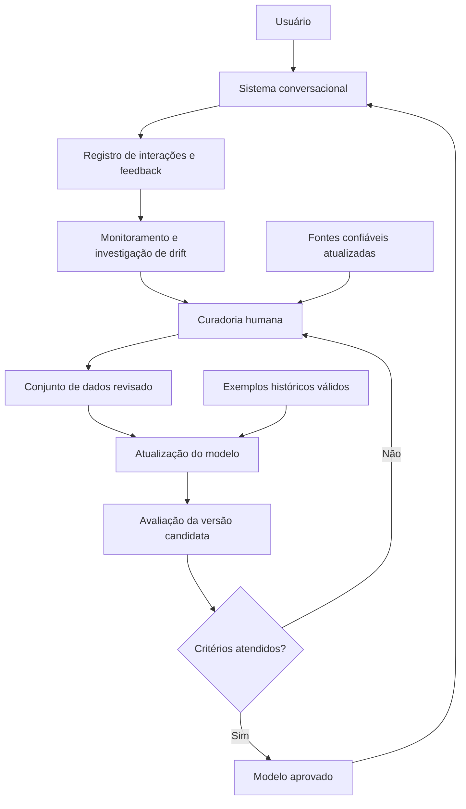

# Proposta de aprendizado contínuo para um sistema conversacional

**Autora:** Mariana Reis

**Tema:** Alternativa 1 — aprendizado contínuo

## 1. Introdução

Um sistema conversacional pode responder corretamente no momento em que é criado e, ainda assim, perder qualidade com o tempo. Novos assuntos aparecem, procedimentos mudam e informações antes válidas deixam de ser atuais. Como o conhecimento de um modelo de linguagem é aprendido a partir dos dados disponíveis durante seu treinamento, ele não incorpora automaticamente essas mudanças. Por exemplo, a resposta a uma pergunta sobre o prazo de inscrição de um serviço pode mudar de um ano para outro.

Esse cenário se relaciona ao *concept drift*: a relação entre as entradas recebidas e as respostas esperadas se altera ao longo do tempo (GAMA et al., 2014). No exemplo do prazo, a pergunta pode continuar igual, mas a resposta correta muda. Uma queda na qualidade das respostas pode indicar essa mudança, embora também possa ter outras causas; por isso, ela precisa ser investigada.

O aprendizado contínuo procura atualizar um modelo à medida que surgem dados novos. A dificuldade é aprender informações recentes sem prejudicar conhecimentos anteriores que continuam corretos, problema conhecido como *esquecimento catastrófico* (PARISI et al., 2019). No artigo fornecido como material de apoio, Jang et al. (2022) propõem avaliar separadamente três resultados dessa atualização: **preservar conhecimentos invariáveis, corrigir conhecimentos desatualizados e adquirir conhecimentos novos**. Essa distinção orienta a proposta a seguir.

## 2. Solução proposta

Proponho um ciclo periódico e controlado para atualizar o modelo de linguagem usado por um sistema conversacional. Interações que sugerem respostas desatualizadas seriam analisadas junto a fontes confiáveis e recentes. Uma equipe revisaria os exemplos, prepararia dados de atualização, treinaria uma versão candidata e a compararia com a versão em produção antes de publicá-la. O ciclo não depende de atualizar o modelo após cada conversa.

### 2.1. Diagrama de arquitetura

As setas representam o fluxo proposto de dados e decisões. O modelo aprovado permanece disponível enquanto uma nova versão é preparada e testada.

### 2.2. Responsabilidades dos blocos

| Bloco | Responsabilidade |
| --- | --- |
| Sistema conversacional | Receber perguntas e gerar respostas usando a versão aprovada do modelo. |
| Registro de interações e feedback | Guardar amostras de perguntas, respostas e correções necessárias à análise. Antes de reutilizá-las, remover ou reduzir dados pessoais. |
| Monitoramento e investigação de drift | Acompanhar erros confirmados, correções frequentes e assuntos novos. Sinalizar mudanças para revisão, sem considerar qualquer resposta ruim uma prova automática de drift. |
| Fontes confiáveis atualizadas | Fornecer a versão vigente das informações que podem confirmar ou corrigir uma resposta. |
| Curadoria humana | Verificar a fonte e classificar cada caso como conhecimento que deve permanecer, informação que precisa ser corrigida ou conhecimento novo. Descartar exemplos ambíguos ou incorretos. |
| Conjunto de dados revisado | Reunir exemplos com perguntas, respostas esperadas, fonte e data de validade para treinamento e avaliação. |
| Exemplos históricos válidos | Preservar casos antigos que continuam corretos para verificar regressões e, quando apropriado, compor parte do treinamento. |
| Atualização do modelo | Produzir uma versão candidata a partir dos dados revisados. Um piloto pode comparar o ajuste de adaptadores com a mistura de exemplos novos e históricos, conforme os recursos disponíveis. |
| Avaliação da versão candidata | Testar separadamente a preservação de fatos estáveis, a correção de fatos alterados e a aprendizagem de fatos novos. Rejeitar versões que causem perda inaceitável de qualidade. |
| Modelo aprovado | Atender os usuários com a versão validada e permitir retorno à versão anterior caso surjam problemas após a publicação. |

### 2.3. Como avaliar a atualização

A equipe manteria três grupos de perguntas com respostas verificadas. O primeiro reuniria fatos que continuam válidos; o segundo, perguntas cuja resposta correta mudou; o terceiro, assuntos que não estavam presentes na versão anterior. Essa divisão adapta à proposta as três categorias usadas por Jang et al. (2022). Por exemplo, em um atendimento genérico, um endereço de contato que permanece válido pertence ao primeiro grupo; uma regra alterada, ao segundo; e um serviço recém-criado, ao terceiro.

Os exemplos reservados para avaliação não seriam usados no treinamento. A cada ciclo, a equipe compararia a versão candidata com a versão em produção quanto à correção factual das respostas nos três grupos, registrando também respostas sem fundamento e casos em que o sistema deveria declarar incerteza. Os limites de aprovação seriam definidos a partir de uma medição inicial. A nova versão só entraria em produção após revisão humana dos resultados; sua identificação e a versão dos dados seriam registradas para permitir auditoria e retorno à versão anterior.

O artigo de Jang et al. (2022) mostra que aprender conhecimentos novos e preservar os antigos envolve uma troca difícil. Portanto, misturar exemplos históricos ou usar adaptadores são **estratégias a testar**, não garantias de que o esquecimento desaparecerá. Atualizar uma fonte externa de consulta pode ajudar a oferecer respostas recentes, mas, por si só, não demonstra que o conhecimento interno do modelo foi atualizado.

## 3. Conclusão

Considero a proposta útil porque transforma a atualização do sistema em um processo verificável: antes de publicar uma versão, seria possível observar o que ela preservou, corrigiu e aprendeu. Para mim, a parte mais importante é a revisão dos dados por pessoas capazes de confirmar qual resposta está correta em cada momento. Sem essa etapa, o modelo pode aprender informações equivocadas com aparência de novidade.

A implementação exigiria esforço para coletar e tratar interações, manter fontes confiáveis, preparar os três grupos de avaliação, executar o treinamento e acompanhar a versão publicada. Eu começaria com um piloto pequeno e periódico, em um conjunto limitado de assuntos, para medir o benefício real antes de ampliar ou automatizar o processo.

## Referências bibliográficas

GAMA, João et al. A survey on concept drift adaptation. **ACM Computing Surveys**, New York, v. 46, n. 4, art. 44, p. 1-37, 2014. DOI: 10.1145/2523813. Disponível em: https://doi.org/10.1145/2523813. Acesso em: 4 out. 2026.

JANG, Joel et al. Towards continual knowledge learning of language models. In: INTERNATIONAL CONFERENCE ON LEARNING REPRESENTATIONS, 2022. **Proceedings [...].** [S. l.]: ICLR, 2022. Disponível em: https://arxiv.org/abs/2110.03215. Acesso em: 4 out. 2026.

PARISI, German I. et al. Continual lifelong learning with neural networks: a review. **Neural Networks**, Amsterdam, v. 113, p. 54-71, 2019. DOI: 10.1016/j.neunet.2019.01.012. Disponível em: https://doi.org/10.1016/j.neunet.2019.01.012. Acesso em: 4 out. 2026.
